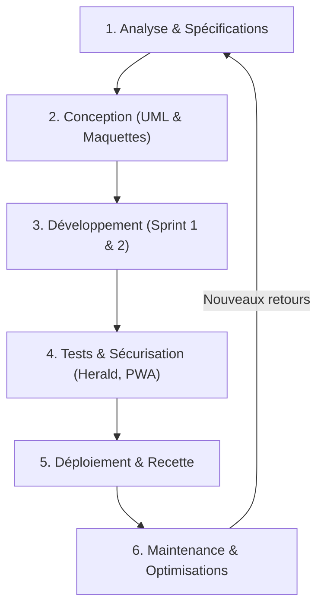

# Analyse du Cycle de Vie & Conformité du Projet — YA Consulting

Ce document présente une analyse détaillée du **cycle de vie** de l'application "Portail Terrain" ainsi qu'un **bilan de conformité** vis-à-vis du cahier des charges initial suite aux récentes modifications.

---

## 1. Le Cycle de Vie du Projet (SDLC)

L'application suit un cycle de vie incrémental et itératif (proche des méthodologies Agile/Scrum) adapté pour intégrer rapidement les retours utilisateurs et les contraintes techniques.

### Détail des phases de vie de YA Consulting :
1. **Analyse & Spécifications** : Définition des besoins des deux profils clés (Administrateurs et Techniciens sur le terrain).
2. **Conception** : Modélisation des parcours (diagramme de cas d'utilisation UML) et choix des briques technologiques (React, Leaflet, Node, Express, Prisma, PostgreSQL).
3. **Développement** : Création du backend REST, du dashboard administrateur, et du simulateur mobile avec le mode hors-ligne (degraded mode) et le système PWA.
4. **Sécurisation & Qualité (Phase Actuelle)** : Utilisation d'outils d'analyse statique comme **Herald** pour faire passer l'application d'un grade **F (30/100)** à un grade **C (69/100)** en éliminant les vulnérabilités de dépendances, les goulots d'entranglement de performance (I/O Nominatim en boucle), et en fiabilisant l'expérience utilisateur.
5. **Déploiement** : Mise en production sur serveurs Cloud (ex: Heroku/Render pour le back, Netlify/Vercel pour le front, base PostgreSQL managée).

---

## 2. Bilan de Conformité avec le Cahier des Charges

Malgré les nombreuses modifications requises pour optimiser la qualité du code, **l'application reste en parfaite harmonie avec son cahier des charges initial**. Les fonctionnalités ont été enrichies de manière sécurisée et non-bloquante.

### Tableau de Conformité des Exigences :

| Fonctionnalité Requise | Statut | Implémentation technique dans le code |
| :--- | :---: | :--- |
| **Profil Administrateur** | **100% Conforme** | Géré dans `AdminDashboard.jsx`. Permet de gérer les clients, employés, interventions et de superviser la carte. |
| **Profil Technicien (Mobile)** | **100% Conforme** | Géré dans `MobileSimulator.jsx`. Affiche les interventions, la position GPS et permet le guidage. |
| **Géolocalisation & Guidage** | **100% Conforme** | Intégration de Leaflet + OpenStreetMap + Leaflet Routing Machine pour le calcul d'itinéraires et le suivi en temps réel. |
| **Fonctionnement Offline** | **100% Conforme** | Service Worker PWA (`sw.js`) pour mettre en cache l'application. Système de cache `localStorage` pour les données clients/opérations en cas de perte réseau. |
| **Signalement d'anomalies** | **100% Conforme** | Les techniciens peuvent signaler un problème d'adresse directement depuis leur mobile, qui remonte en temps réel sur le tableau de bord admin. |
| **Partage & Onboarding** | **Enrichi (Nouveau)** | Les codes d'invitation génèrent maintenant un lien d'inscription direct et sont partageables en un clic grâce à l'API native `navigator.share`. |

---

## 3. Recommandations pour les Prochaines Étapes
1. **Finaliser la couverture de tests** : Mettre en place des tests d'intégration automatisés pour valider le comportement hors-ligne.
2. **Surveillance de production (APM)** : Intégrer un système de log distant structuré pour suivre les anomalies de géolocalisation des techniciens en temps réel.
