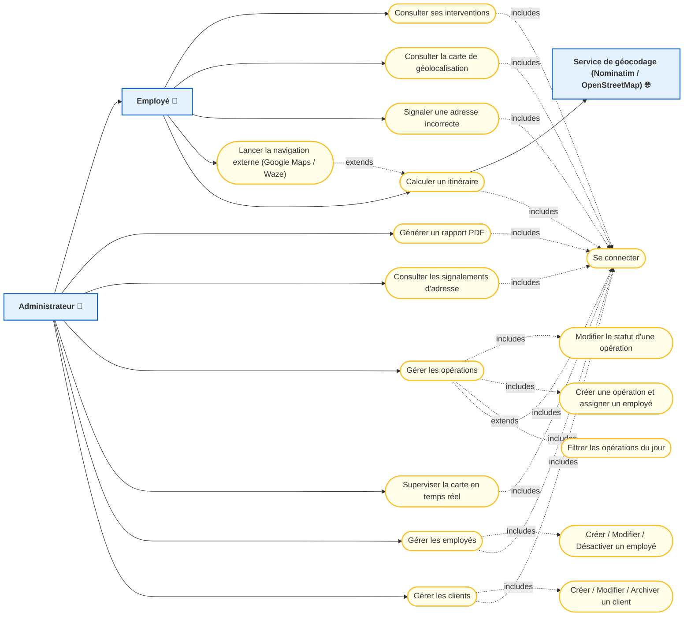

# Diagramme de Cas d'Utilisation UML — YA Consulting

Ce document reproduit le diagramme de cas d'utilisation UML du **Système de géolocalisation YA Consulting** en format textuel **Mermaid**.

```mermaid
graph LR
    %% Acteurs
    Admin["Administrateur 👤"]
    Employe["Employé 👷"]
    OSM["Service de géocodage (Nominatim / OpenStreetMap) 🌐"]

    %% Généralisation Acteurs
    Admin --> Employe

    %% Cas d'utilisation Administrateur
    UC_PDF(["Générer un rapport PDF"])
    UC_Sig(["Consulter les signalements d'adresse"])
    UC_Ops(["Gérer les opérations"])
    UC_MapReal(["Superviser la carte en temps réel"])
    UC_Emps(["Gérer les employés"])
    UC_Clients(["Gérer les clients"])

    %% Sous-cas d'utilisation Administrateur
    UC_ModOp(["Modifier le statut d'une opération"])
    UC_CreOp(["Créer une opération et assigner un employé"])
    UC_FilOp(["Filtrer les opérations du jour"])
    UC_CreEmp(["Créer / Modifier / Désactiver un employé"])
    UC_CreCli(["Créer / Modifier / Archiver un client"])

    %% Cas d'utilisation Employé
    UC_ConsInter(["Consulter ses interventions"])
    UC_ConsMap(["Consulter la carte de géolocalisation"])
    UC_SigAdr(["Signaler une adresse incorrecte"])
    UC_NavExt(["Lancer la navigation externe (Google Maps / Waze)"])
    UC_CalcItin(["Calculer un itinéraire"])

    %% Cas d'utilisation Commun
    UC_Connect(["Se connecter"])

    %% Liaisons de l'Administrateur
    Admin --> UC_PDF
    Admin --> UC_Sig
    Admin --> UC_Ops
    Admin --> UC_MapReal
    Admin --> UC_Emps
    Admin --> UC_Clients

    %% Relations d'inclusion / extension Administrateur
    UC_Ops -.->|includes| UC_ModOp
    UC_Ops -.->|includes| UC_CreOp
    UC_Ops -.->|extends| UC_FilOp
    UC_Emps -.->|includes| UC_CreEmp
    UC_Clients -.->|includes| UC_CreCli

    %% Liaisons de l'Employé
    Employe --> UC_ConsInter
    Employe --> UC_ConsMap
    Employe --> UC_SigAdr
    Employe --> UC_NavExt
    Employe --> UC_CalcItin

    %% Relations d'inclusion / extension Employé
    UC_NavExt -.->|extends| UC_CalcItin
    UC_CalcItin --> OSM

    %% Relation d'inclusion globale : Se connecter
    UC_PDF -.->|includes| UC_Connect
    UC_Sig -.->|includes| UC_Connect
    UC_Ops -.->|includes| UC_Connect
    UC_MapReal -.->|includes| UC_Connect
    UC_Emps -.->|includes| UC_Connect
    UC_Clients -.->|includes| UC_Connect
    UC_ConsInter -.->|includes| UC_Connect
    UC_ConsMap -.->|includes| UC_Connect
    UC_SigAdr -.->|includes| UC_Connect
    UC_CalcItin -.->|includes| UC_Connect

    %% Styles des nœuds
    classDef actor fill:#e3f2fd,stroke:#1565c0,stroke-width:2px,font-weight:bold;
    classDef usecase fill:#fffde7,stroke:#fbc02d,stroke-width:2px;

    class Admin,Employe,OSM actor;
    class UC_PDF,UC_Sig,UC_Ops,UC_MapReal,UC_Emps,UC_Clients,UC_ModOp,UC_CreOp,UC_FilOp,UC_CreEmp,UC_CreCli,UC_ConsInter,UC_ConsMap,UC_SigAdr,UC_NavExt,UC_CalcItin,UC_Connect usecase;
```
